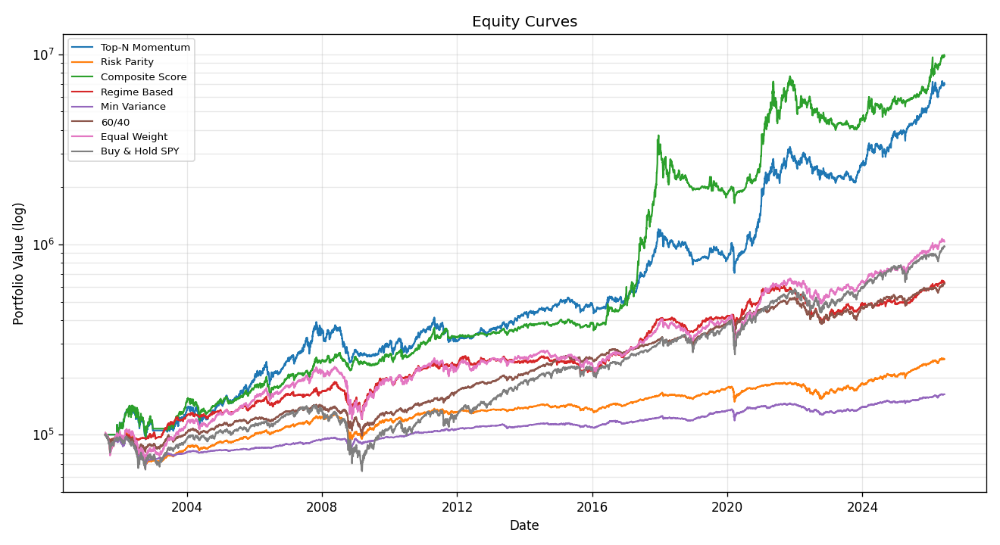
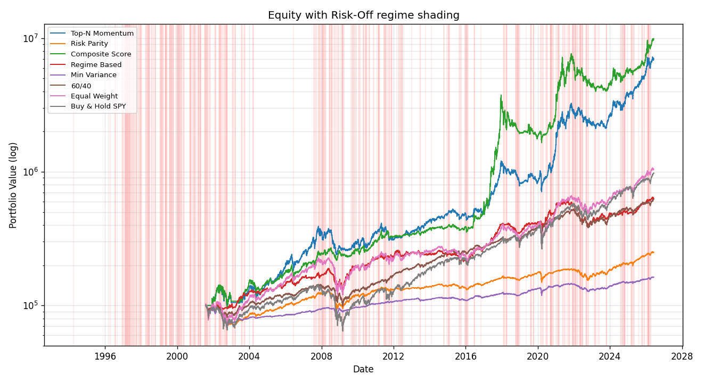

<h1 align="center">Capital Rotation Tracker &amp; Strategy Backtester</h1>

<p align="center">
  <b>글로벌 자산군 간 자금 순환(Capital Rotation)을 분석하고, 로테이션 기반 전략을 백테스팅·비교하는 Python 퀀트 리서치 프레임워크</b>
</p>

<p align="center">
  
  
  
  
</p>

<p align="center">
  
</p>

---

## 이게 뭔가요?

26개 글로벌 자산(미국·한국·신흥·선진국 주식, 크립토, 채권, 원자재, 부동산, FX, VIX)을 `yfinance`로 수집하고, **모멘텀·변동성·상관관계·시장 레짐**을 분석해 6가지 포트폴리오 전략을 **look-ahead bias 없이** 백테스팅합니다. 단순히 수익률을 비교하는 데서 그치지 않고, **out-of-sample 검증**과 **다중검정 보정(Deflated Sharpe)** 으로 *"이 성과가 과적합인가, 진짜인가"* 까지 답하는 것이 목표입니다.

> ⚠️ **교육·연구 목적**입니다. 실제 투자 판단에 사용하지 마세요. 과거 성과는 미래를 보장하지 않습니다.

---

## ✨ 핵심 특징

- 🌐 **26개 자산 × 33년** — ETF/지수 기반으로 자산군 전체 흐름 추적, 증분 수집 + Parquet 저장
- 🧠 **6개 전략 + 3개 벤치마크** — Top-N 모멘텀 · 리스크패리티(역변동성/ERC) · 복합스코어링 · 레짐기반 · 최소분산 · 레짐버짓
- 🔒 **Look-ahead bias 구조적 차단** — 모든 시그널은 후행 윈도우만 사용, 전 모듈이 *절단 검사*로 자동 검증 (20/20 통과)
- 🔬 **과적합 방어 내장** — Out-of-Sample valid/test 분할 + 워크포워드, **Deflated Sharpe Ratio** + James-Stein 수축
- 📈 **자체 구현 HMM 레짐** — numpy 가우시안 HMM + Hamilton 전방필터(미래 미참조), 모든 위기 자동 포착
- 📊 **전 성과지표** — CAGR · Sharpe · Sortino · MDD(+회복기간) · Calmar · 승률 · 손익비 · Alpha/Beta · 회전율
- ⚙️ **설정 중심** — 자산·전략·수수료·기간을 YAML로 관리, 코드 수정 없이 실험
- 🎛️ **선택적 리스크 오버레이** — 포지션 캡 + 상관 급등 디레버리징

---

## 📊 성과 미리보기

전 전략 비교 (2001–2026, 전략별 최적 리밸런싱, 초기자본 $100k, 편도비용 0.15%) — *참고용, 미래 보장 아님*:

| 전략 | CAGR | Sharpe | Sortino | MaxDD | Calmar |
|------|-----:|-------:|--------:|------:|-------:|
| **Composite Score** | **20.3%** | 0.74 | 1.09 | −56.1% | 0.36 |
| **Top-N Momentum** ⭐ | 18.6% | **0.76** | 1.07 | −41.2% | **0.45** |
| Equal Weight | 11.2% | 0.58 | 0.81 | −46.1% | 0.24 |
| Buy & Hold SPY | 10.3% | 0.50 | 0.70 | −55.2% | 0.19 |
| Regime Based | 9.1% | 0.56 | 0.79 | −31.1% | 0.29 |
| 60/40 | 8.2% | 0.58 | 0.82 | −30.2% | 0.27 |
| Risk Parity | 4.7% | 0.33 | 0.45 | −32.1% | 0.15 |
| Min Variance | 2.7% | 0.12 | 0.16 | −32.0% | 0.08 |

> ⭐ **Top-N Momentum**(12개월 모멘텀, 상위 5종목 동일비중)은 비슷한 수익을 더 낮은 낙폭·회전율로 — 위험조정·강건성 종합 1위. (튜닝 근거: `scripts/topn_sweep.py`)

```bash
python cli.py backtest compare    # 위 표 + 다중검정 보정(DSR)을 직접 출력
```

---

## 🔬 검증 엄밀성 — 이 프로젝트의 차별점

여러 전략·파라미터를 탐색하고 *최고 수치만* 보고하면 데이터 스누핑(승자의 저주)입니다. 이를 정면으로 다룹니다:

| 도구 | 답하는 질문 | 명령 |
|------|------------|------|
| **Out-of-Sample 분할** | 검증창에서 고른 설정이 테스트창에서도 통하나? | `backtest oos` |
| **Deflated Sharpe Ratio** | N번 탐색을 감안해도 Sharpe가 유의한가? | `backtest compare` |
| **HMM 레짐 + 레짐버짓** | 국면에 따라 익스포저를 조절하면 낙폭이 주나? | `backtest run --strategy regime_budget` |

> 💡 **실제 발견**: 검증창 최고 성과였던 60/40은 OOS 테스트에서 Sharpe가 반토막 났지만, 모멘텀 전략은 테스트창에서도 강건했습니다 — *단일 백테스트가 숨기는 진실*. 또한 자체 HMM 레짐은 2008·2020·2022 위기를 모두 자동 포착하며, 절단 검사로 미래 미참조를 100% 확인했습니다.

<p align="center">
  <br>
  <sub>HMM이 감지한 Risk-Off 구간(붉은 음영) — 위기마다 정확히 켜집니다</sub>
</p>

---

## 🚀 빠른 시작

```bash
# 설치 (Python >= 3.10)
pip install -r requirements.txt

# 1) 데이터 수집 (증분 업데이트)
python cli.py data update
python cli.py data status

# 2) 현재 시장 분석
python cli.py analyze regime          # Risk-On/Off 판단
python cli.py analyze momentum         # 모멘텀 순위
python cli.py analyze rotation         # 카테고리 자금 유입/유출

# 3) 백테스트
python cli.py backtest compare         # 전 전략 비교 + 다중검정 보정
python cli.py backtest oos             # 과적합 점검 (valid→test)
python cli.py backtest report          # output/REPORT.md (표+차트+보정 통합)

# 4) 차트 (output/*.png)
python cli.py chart equity             # 누적 수익 곡선
python cli.py chart regime             # Risk-Off 음영 누적수익
python cli.py chart correlation        # 상관관계 히트맵

# 전체 수용 테스트 (look-ahead 절단 검사 포함)
python -m tests.check_module all
```

> Windows에서 박스 문자가 깨지면 `set PYTHONIOENCODING=utf-8` (CLI가 자동 시도).

---

## 🧠 전략

| 전략 | 키 | 한 줄 설명 |
|------|----|-----------|
| **Top-N 모멘텀** | `topn` | 12개월 모멘텀 상위 N개 동일비중, 절대모멘텀 음수면 현금 |
| **리스크 패리티** | `risk_parity` | 변동성 역수 비중 / `method: erc`로 진짜 위험기여도 균등화 |
| **복합 스코어링** | `momentum_score` | 모멘텀·거래량·변동성·상관을 z-score로 종합 |
| **레짐 기반** | `regime_based` | Risk-On/Off에 따라 자산군 배분 전환 |
| **최소 분산** | `min_variance` | Ledoit-Wolf 수축 공분산 기반 long-only 최소분산 |
| **레짐 버짓** | `regime_budget` | 베이스 전략 익스포저를 레짐(rule/**HMM**)으로 조절 |
| _벤치마크_ | `bench_6040` · `bench_equal` · `bench_bh` | 60/40 · 동일비중 · Buy&Hold SPY |

리밸런싱: **weekly / monthly / quarterly / signal**(임계값 기반). 거래비용·슬리피지 설정 가능.

---

<details>
<summary><b>🗂️ 프로젝트 구조</b></summary>

```
capital_rotation/
├── config/            # assets · strategy · backtest (YAML)
├── src/
│   ├── data/          # fetcher(yfinance) · storage(parquet) · preprocess(MarketData)
│   ├── analysis/      # momentum · volume · volatility · correlation · regime · regime_hmm(+_hmm) · rotation
│   ├── strategy/      # base(+registry) · topn · risk_parity · momentum_score · regime_based
│   │                  #   · min_variance · regime_budget · benchmark · _riskopt
│   ├── backtest/      # engine · metrics · runner · report · overlay · splits · sharpe_correction
│   └── visualization/ # tables(rich) · charts(matplotlib)
├── tests/             # fixtures(합성데이터) · check_module(수용 테스트 + look-ahead 검사)
├── scripts/           # topn_sweep · hmm_compare (재현 가능한 실험)
└── cli.py             # CLI 엔트리포인트
```

**데이터 계약 (`MarketData`)**: 모든 분석/전략이 공유하는 wide DataFrame 묶음(`prices`(수정종가)·`returns`·`volume`·`dollar_volume` 등). **불변식**: 날짜 `t`의 값은 `index <= t` 데이터만 사용 — 이것이 look-ahead 방지의 토대입니다.
</details>

<details>
<summary><b>⚙️ 설정 (config/)</b></summary>

- **`assets.yaml`** — 자산 목록·카테고리·`tradable` 플래그·레짐용 `roles`
- **`strategy.yaml`** — 전략별 파라미터, 벤치마크 정의 (예: `topn.lookback_weights`, `regime_budget.regime_source: hmm`)
- **`backtest.yaml`** — 초기자본·기간·수수료·리밸런싱·리스크 오버레이

자산 추가/제거는 `assets.yaml` 한 줄. 각 자산의 가용 기간은 자동 감지됩니다.
</details>

---

## ⚠️ 면책

이 프로젝트는 **교육 및 연구 목적**입니다. 실제 투자에는 추가적인 리스크 관리와 검증이 필요합니다. 과거 성과가 미래 수익을 보장하지 않으며, `yfinance` 데이터는 공식 피드가 아니라 프로덕션 트레이딩에 부적합합니다. 백테스트에는 과적합 위험이 있으므로 in-sample / out-of-sample 분리를 권장합니다.

<p align="center"><sub>Built with Python · pandas · numpy · scipy · scikit-learn · matplotlib · rich · click</sub></p>
